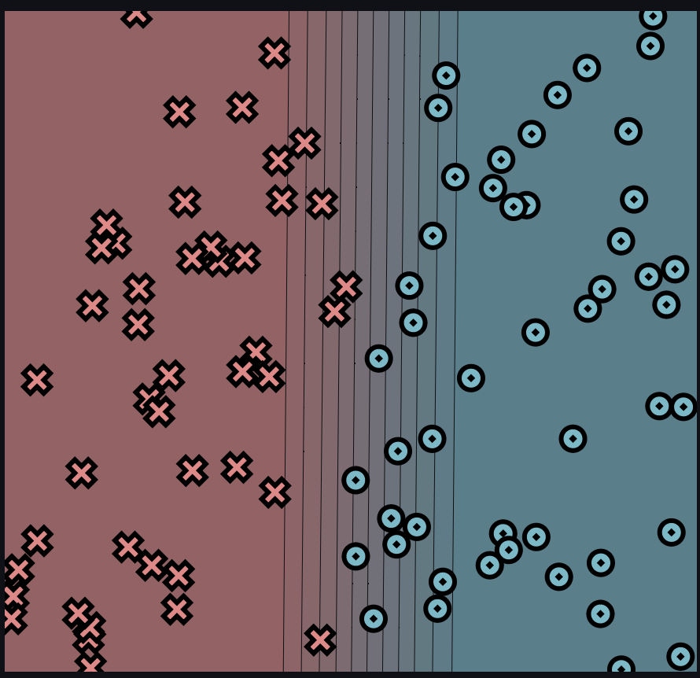
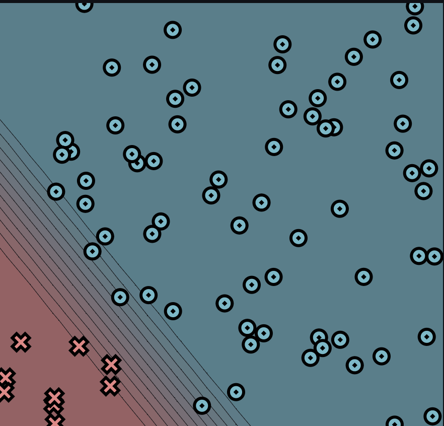

# MiniTorch Module 0

* Docs: https://minitorch.github.io/

* Overview: https://minitorch.github.io/module0/module0/

# Task 0.5
## Simple Dataset:
# Parameters
linear.weight_0_0: -10, linear.weight_1_0: 0.09, linear.bias_0: 4.62

Diagonal Dataset:
Parameters: linear.weight_0_0: -10, linear.weight_1_0: -7.78, linear.bias_0: 4.18

