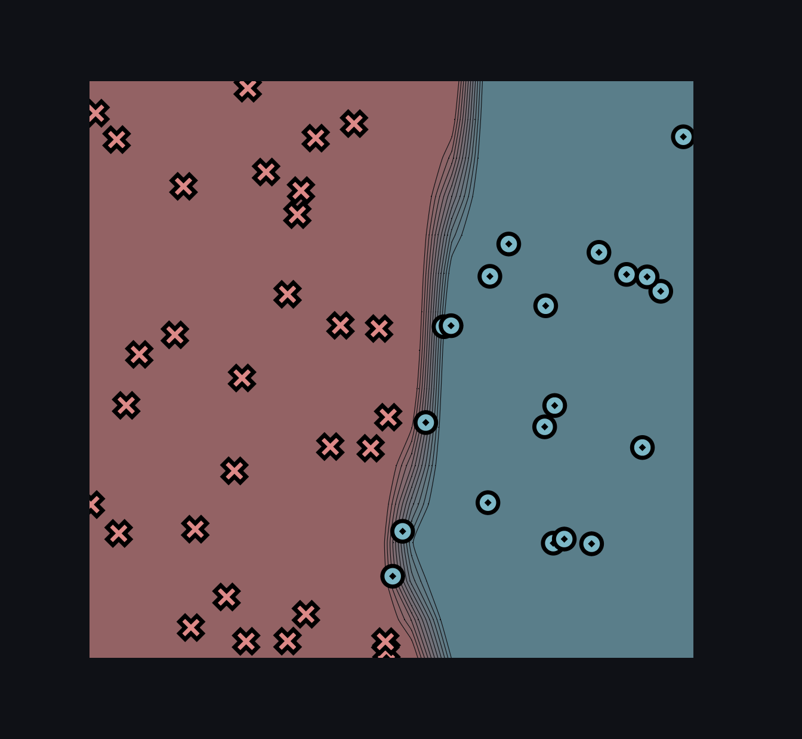
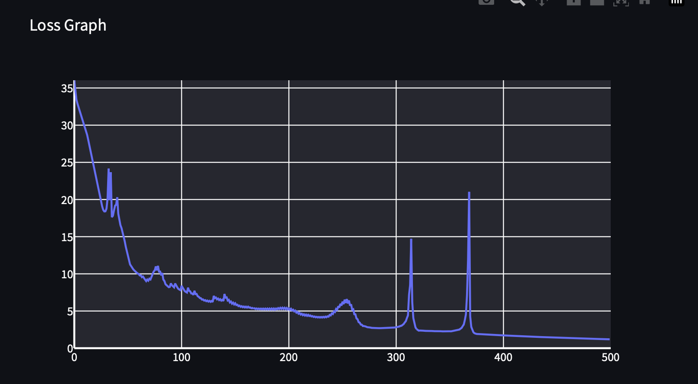
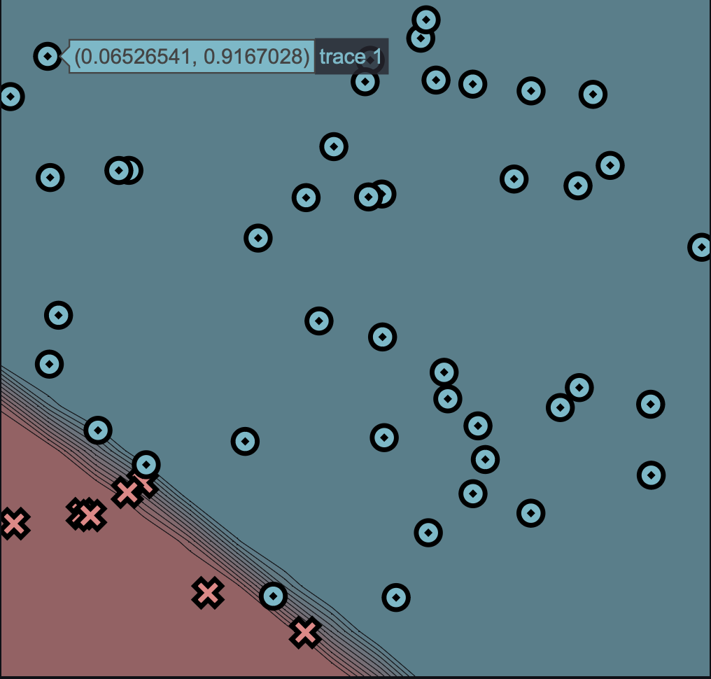
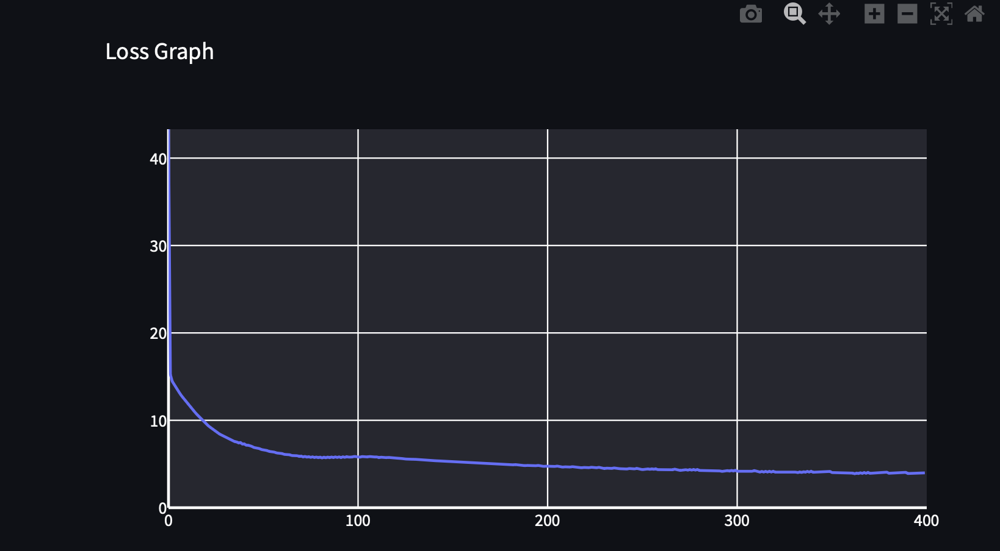
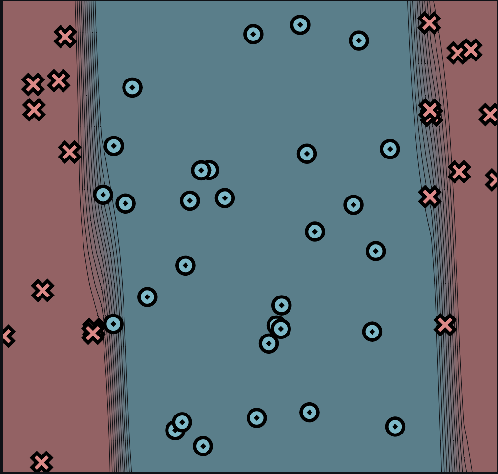
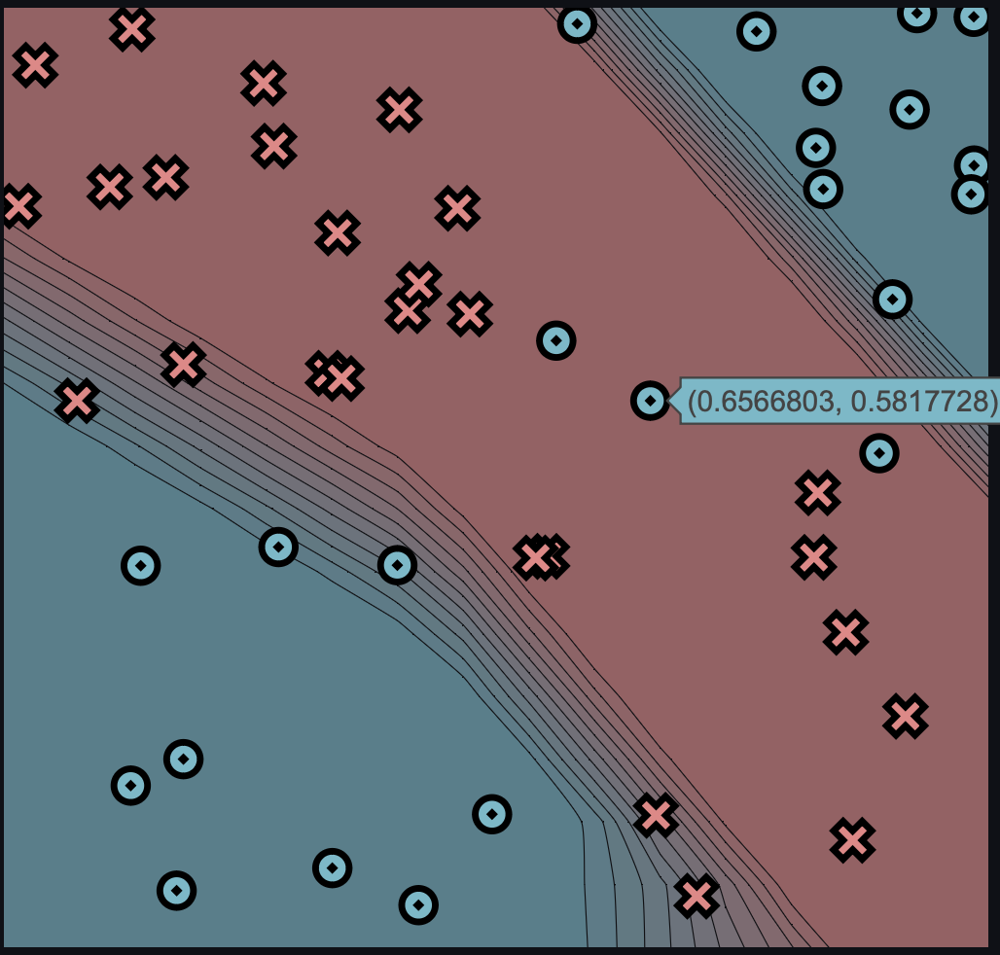
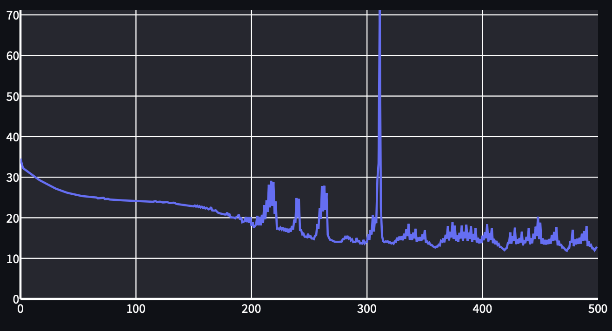

[](https://classroom.github.com/a/7COonC5j)
# MiniTorch Module 1


* Docs: https://minitorch.github.io/

* Overview: https://minitorch.github.io/module1/module1/

This assignment requires the following files from the previous assignments. You can get these by running

```bash
python sync_previous_module.py previous-module-dir current-module-dir
```

The files that will be synced are:

        minitorch/operators.py minitorch/module.py tests/test_module.py tests/test_operators.py project/run_manual.py

# Task 1.5

## Training a scalar model on a simple dataset

### Output log:

Epoch: 0/500, loss: 0, correct: 0
Epoch: 10/500, loss: 30.31133764975098, correct: 30
Epoch: 20/500, loss: 23.605223598676556, correct: 42
Epoch: 30/500, loss: 18.409822582183622, correct: 42
Epoch: 40/500, loss: 19.293607893482736, correct: 41
Epoch: 50/500, loss: 13.055552841967362, correct: 44
Epoch: 60/500, loss: 10.041638614834936, correct: 46
Epoch: 70/500, loss: 9.081771124825226, correct: 46
Epoch: 80/500, loss: 10.292808657998531, correct: 45
Epoch: 90/500, loss: 8.241456880027634, correct: 45
Epoch: 100/500, loss: 7.800519134721618, correct: 45
Epoch: 110/500, loss: 7.361363525060136, correct: 46
Epoch: 120/500, loss: 6.534183050478641, correct: 47
Epoch: 130/500, loss: 6.21663437771955, correct: 47
Epoch: 140/500, loss: 6.3466417786280225, correct: 47
Epoch: 150/500, loss: 5.886835714486873, correct: 47
Epoch: 160/500, loss: 5.4780472699086316, correct: 47
Epoch: 170/500, loss: 5.267457709371037, correct: 48
Epoch: 180/500, loss: 5.206132188369085, correct: 47
Epoch: 190/500, loss: 5.229912031513625, correct: 47
Epoch: 200/500, loss: 5.203245166451497, correct: 47
Epoch: 210/500, loss: 4.6372238746409495, correct: 48
Epoch: 220/500, loss: 4.325375102522879, correct: 48
Epoch: 230/500, loss: 4.115396008438377, correct: 48
Epoch: 240/500, loss: 4.405696877353695, correct: 48
Epoch: 250/500, loss: 5.728409571516131, correct: 47
Epoch: 260/500, loss: 5.174178894256101, correct: 47
Epoch: 270/500, loss: 2.978440571847766, correct: 49
Epoch: 280/500, loss: 2.7093146575161344, correct: 49
Epoch: 290/500, loss: 2.7239415931198567, correct: 49
Epoch: 300/500, loss: 2.7833875260026333, correct: 49
Epoch: 310/500, loss: 3.6197401714748763, correct: 48
Epoch: 320/500, loss: 2.5707223073045355, correct: 49
Epoch: 330/500, loss: 2.3183355702297557, correct: 50
Epoch: 340/500, loss: 2.275427374527363, correct: 49
Epoch: 350/500, loss: 2.2590988878610587, correct: 49
Epoch: 360/500, loss: 2.5069069878182835, correct: 49
Epoch: 370/500, loss: 4.293551854175895, correct: 48
Epoch: 380/500, loss: 1.9005381905811027, correct: 50
Epoch: 390/500, loss: 1.8533636894090102, correct: 50
Epoch: 400/500, loss: 1.7338735869048894, correct: 50
Epoch: 410/500, loss: 1.6545931565846392, correct: 50
Epoch: 420/500, loss: 1.588549565054936, correct: 50
Epoch: 430/500, loss: 1.5308011155676515, correct: 50
Epoch: 440/500, loss: 1.4760301726854308, correct: 50
Epoch: 450/500, loss: 1.4228873242090765, correct: 50
Epoch: 460/500, loss: 1.37322974409433, correct: 50
Epoch: 470/500, loss: 1.3256286750502564, correct: 50
Epoch: 480/500, loss: 1.2799825849336255, correct: 50
Epoch: 490/500, loss: 1.2362046417346602, correct: 50
Epoch: 500/500, loss: 1.1942154992247682, correct: 50







## Diagonal

Epoch: 10/400, loss: 12.203576485979477, correct: 43
Epoch: 20/400, loss: 9.764093713527426, correct: 43
Epoch: 30/400, loss: 8.16669694273166, correct: 47
Epoch: 40/400, loss: 7.281618019416461, correct: 48
Epoch: 50/400, loss: 6.657278539576404, correct: 48
Epoch: 60/400, loss: 6.1776228536643485, correct: 49
Epoch: 70/400, loss: 5.865452360311217, correct: 49
Epoch: 80/400, loss: 5.725172211399908, correct: 48
Epoch: 90/400, loss: 5.750761180014027, correct: 47
Epoch: 100/400, loss: 5.816500759913178, correct: 47
Epoch: 110/400, loss: 5.800687100892744, correct: 47
Epoch: 120/400, loss: 5.690670276283437, correct: 47
Epoch: 130/400, loss: 5.540579408732957, correct: 47
Epoch: 140/400, loss: 5.387289282704393, correct: 47
Epoch: 150/400, loss: 5.239047819581829, correct: 47
Epoch: 160/400, loss: 5.122797488591856, correct: 47
Epoch: 170/400, loss: 5.001970325804528, correct: 47
Epoch: 180/400, loss: 4.927779072919927, correct: 47
Epoch: 190/400, loss: 4.840092123120395, correct: 47
Epoch: 200/400, loss: 4.755179194088336, correct: 47
Epoch: 210/400, loss: 4.678829896590805, correct: 47
Epoch: 220/400, loss: 4.609396884091473, correct: 47
Epoch: 230/400, loss: 4.522325239125495, correct: 47
Epoch: 240/400, loss: 4.456531108142881, correct: 47
Epoch: 250/400, loss: 4.405653919013082, correct: 47
Epoch: 260/400, loss: 4.358159943509859, correct: 47
Epoch: 270/400, loss: 4.312693554289939, correct: 47
Epoch: 280/400, loss: 4.375035747744139, correct: 47
Epoch: 290/400, loss: 4.31997803365356, correct: 47
Epoch: 300/400, loss: 4.278715967168209, correct: 47
Epoch: 310/400, loss: 4.251130305204751, correct: 47
Epoch: 320/400, loss: 4.172568613791362, correct: 47
Epoch: 330/400, loss: 4.173855602425721, correct: 47
Epoch: 340/400, loss: 4.174579581027463, correct: 47
Epoch: 350/400, loss: 4.149558142342582, correct: 47
Epoch: 360/400, loss: 4.062802226298206, correct: 48
Epoch: 370/400, loss: 4.041428467063957, correct: 48
Epoch: 380/400, loss: 4.065224957656783, correct: 48
Epoch: 390/400, loss: 4.046135700374127, correct: 48
Epoch: 400/400, loss: 3.9869960469175827, correct: 48





### split

Epoch: 0/500, loss: 0, correct: 0
Epoch: 10/500, loss: 34.04825723748601, correct: 30
Epoch: 20/500, loss: 33.413646838627706, correct: 30
Epoch: 30/500, loss: 32.526273880325, correct: 31
Epoch: 40/500, loss: 31.89628107006863, correct: 31
Epoch: 50/500, loss: 31.59164460729552, correct: 34
Epoch: 60/500, loss: 31.33286051211033, correct: 33
Epoch: 70/500, loss: 31.1341436200663, correct: 34
Epoch: 80/500, loss: 30.898474721719257, correct: 34
Epoch: 90/500, loss: 30.535111999960048, correct: 34
Epoch: 100/500, loss: 29.92123020402563, correct: 34
Epoch: 110/500, loss: 29.043648321786122, correct: 35
Epoch: 120/500, loss: 27.89628406593555, correct: 36
Epoch: 130/500, loss: 26.686913143813673, correct: 38
Epoch: 140/500, loss: 26.32456920427071, correct: 40
Epoch: 150/500, loss: 26.151366280372596, correct: 40
Epoch: 160/500, loss: 24.246621206098222, correct: 40
Epoch: 170/500, loss: 22.956233892880793, correct: 40
Epoch: 180/500, loss: 20.838576779061917, correct: 40
Epoch: 190/500, loss: 20.301647489087678, correct: 40
Epoch: 200/500, loss: 19.758886529741847, correct: 40
Epoch: 210/500, loss: 19.04458216954744, correct: 40
Epoch: 220/500, loss: 18.513646285553435, correct: 40
Epoch: 230/500, loss: 17.126020609761465, correct: 40
Epoch: 240/500, loss: 16.28997097065662, correct: 41
Epoch: 250/500, loss: 14.925855786616172, correct: 44
Epoch: 260/500, loss: 14.568353821168314, correct: 44
Epoch: 270/500, loss: 14.482509635034186, correct: 44
Epoch: 280/500, loss: 10.02256056713007, correct: 46
Epoch: 290/500, loss: 10.740450880293595, correct: 45
Epoch: 300/500, loss: 16.396530810964588, correct: 41
Epoch: 310/500, loss: 7.705962613933989, correct: 46
Epoch: 320/500, loss: 6.086119738796598, correct: 48
Epoch: 330/500, loss: 8.74189579215697, correct: 45
Epoch: 340/500, loss: 12.676802739094006, correct: 44
Epoch: 350/500, loss: 7.719781652365588, correct: 46
Epoch: 360/500, loss: 4.532578912649275, correct: 49
Epoch: 370/500, loss: 4.299777365606073, correct: 49
Epoch: 380/500, loss: 6.089747469794953, correct: 46
Epoch: 390/500, loss: 33.97282669754576, correct: 38
Epoch: 400/500, loss: 3.4863355506757596, correct: 50
Epoch: 410/500, loss: 3.245406011266879, correct: 50
Epoch: 420/500, loss: 3.6852424349176767, correct: 48
Epoch: 430/500, loss: 3.676319164021727, correct: 49
Epoch: 440/500, loss: 4.880723727113223, correct: 48
Epoch: 450/500, loss: 9.277658183861595, correct: 46
Epoch: 460/500, loss: 2.4471029915189275, correct: 50
Epoch: 470/500, loss: 2.1182151012963106, correct: 50
Epoch: 480/500, loss: 1.8757848827582388, correct: 50
Epoch: 490/500, loss: 1.7498924315946593, correct: 50
Epoch: 500/500, loss: 1.6516035151119468, correct: 50




### XOR

Epoch: 0/500, loss: 0, correct: 0
Epoch: 10/500, loss: 30.782150915753366, correct: 35
Epoch: 20/500, loss: 28.86984351265232, correct: 36
Epoch: 30/500, loss: 27.40200730838185, correct: 35
Epoch: 40/500, loss: 26.304069390725775, correct: 37
Epoch: 50/500, loss: 25.594491531841307, correct: 37
Epoch: 60/500, loss: 25.058435301470865, correct: 37
Epoch: 70/500, loss: 24.785090346344248, correct: 37
Epoch: 80/500, loss: 24.48809990250549, correct: 37
Epoch: 90/500, loss: 24.285074916430187, correct: 37
Epoch: 100/500, loss: 24.134092749692137, correct: 37
Epoch: 110/500, loss: 23.98156670666937, correct: 37
Epoch: 120/500, loss: 23.832962095187646, correct: 38
Epoch: 130/500, loss: 23.64520326862633, correct: 37
Epoch: 140/500, loss: 23.236938766317035, correct: 38
Epoch: 150/500, loss: 22.817663096664976, correct: 38
Epoch: 160/500, loss: 22.59720024550051, correct: 38
Epoch: 170/500, loss: 21.843824173514655, correct: 39
Epoch: 180/500, loss: 21.280029613783068, correct: 38
Epoch: 190/500, loss: 20.81069935685135, correct: 37
Epoch: 200/500, loss: 20.15576604260202, correct: 42
Epoch: 210/500, loss: 20.73094590641173, correct: 42
Epoch: 220/500, loss: 28.759146529629078, correct: 39
Epoch: 230/500, loss: 17.477980799260198, correct: 44
Epoch: 240/500, loss: 24.872898709519877, correct: 42
Epoch: 250/500, loss: 16.062594770248747, correct: 45
Epoch: 260/500, loss: 22.327214369756383, correct: 43
Epoch: 270/500, loss: 14.516800625839155, correct: 45
Epoch: 280/500, loss: 14.719348206537262, correct: 45
Epoch: 290/500, loss: 14.034007664034647, correct: 46
Epoch: 300/500, loss: 13.955449636679148, correct: 45
Epoch: 310/500, loss: 29.585988421699714, correct: 39
Epoch: 320/500, loss: 13.855600613238112, correct: 45
Epoch: 330/500, loss: 14.528242474921186, correct: 43
Epoch: 340/500, loss: 14.541755929790662, correct: 43
Epoch: 350/500, loss: 14.668040452507904, correct: 43
Epoch: 360/500, loss: 12.667573334505068, correct: 45
Epoch: 370/500, loss: 14.8412577372897, correct: 44
Epoch: 380/500, loss: 14.101571983123774, correct: 43
Epoch: 390/500, loss: 14.790179643052653, correct: 44
Epoch: 400/500, loss: 13.75801161858951, correct: 43
Epoch: 410/500, loss: 13.731068654970816, correct: 45
Epoch: 420/500, loss: 12.02110673921707, correct: 45
Epoch: 430/500, loss: 13.500070964143411, correct: 46
Epoch: 440/500, loss: 14.261445911544422, correct: 44
Epoch: 450/500, loss: 14.75503454668544, correct: 44
Epoch: 460/500, loss: 13.605495609661018, correct: 45
Epoch: 470/500, loss: 12.660452612831453, correct: 46
Epoch: 480/500, loss: 13.01206450531732, correct: 46
Epoch: 490/500, loss: 14.396548994585583, correct: 45
Epoch: 500/500, loss: 12.862440398910044, correct: 46






