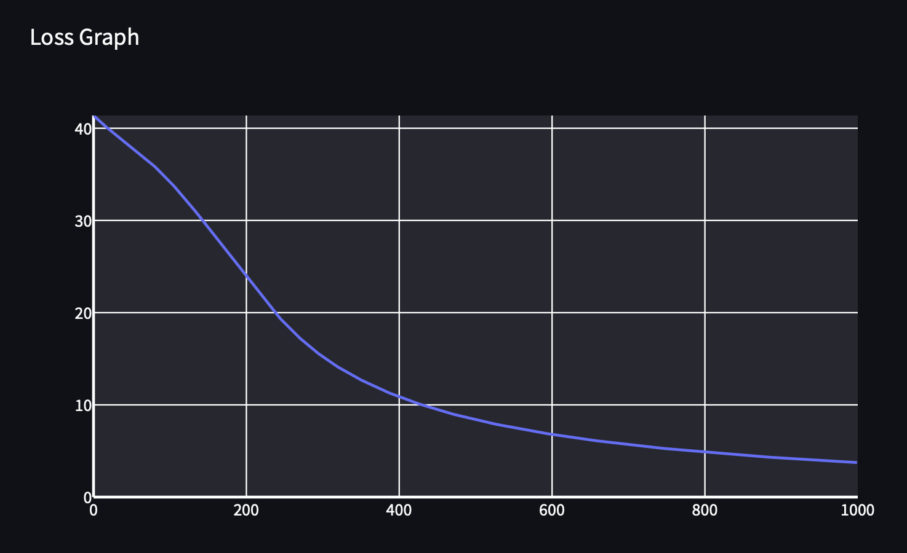

# Task 2.5

## Simple Dataset

- Data Points: 60
- Time per Epoch: 0.027s
- Number of Epochs: 1000

### Logs

 Click to see logs 

        Epoch: 0/1000, loss: 0, correct: 0
        Epoch: 0/1000, loss: 0, correct: 0
        Epoch: 0/1000, loss: 0, correct: 0
        Epoch: 0/1000, loss: 0, correct: 0
        Epoch: 0/1000, loss: 0, correct: 0
        Epoch: 10/1000, loss: 40.66641671388882, correct: 32
        Epoch: 20/1000, loss: 39.97227947459174, correct: 32
        Epoch: 30/1000, loss: 39.3183296648064, correct: 32
        Epoch: 40/1000, loss: 38.6798343708346, correct: 32
        Epoch: 50/1000, loss: 38.03690519707338, correct: 32
        Epoch: 60/1000, loss: 37.373045835148865, correct: 32
        Epoch: 70/1000, loss: 36.67419120360861, correct: 32
        Epoch: 80/1000, loss: 35.93175612071246, correct: 32
        Epoch: 90/1000, loss: 35.13738612100316, correct: 32
        Epoch: 100/1000, loss: 34.28801006774581, correct: 32
        Epoch: 110/1000, loss: 33.38525808154046, correct: 32
        Epoch: 120/1000, loss: 32.43518741484104, correct: 45
        Epoch: 130/1000, loss: 31.43870098618768, correct: 47
        Epoch: 140/1000, loss: 30.396147565921996, correct: 47
        Epoch: 150/1000, loss: 29.33368306844758, correct: 47
        Epoch: 160/1000, loss: 28.26142815270128, correct: 48
        Epoch: 170/1000, loss: 27.1984339214092, correct: 50
        Epoch: 180/1000, loss: 26.13019916290703, correct: 51
        Epoch: 190/1000, loss: 25.05677232675776, correct: 54
        Epoch: 200/1000, loss: 23.98343612398844, correct: 55
        Epoch: 210/1000, loss: 22.917472567046133, correct: 55
        Epoch: 220/1000, loss: 21.86701842228461, correct: 56
        Epoch: 230/1000, loss: 20.84038002781018, correct: 57
        Epoch: 240/1000, loss: 19.85571497045329, correct: 57
        Epoch: 250/1000, loss: 18.952630486868152, correct: 57
        Epoch: 260/1000, loss: 18.110198314894088, correct: 58
        Epoch: 270/1000, loss: 17.31524854212857, correct: 58
        Epoch: 280/1000, loss: 16.57783233834722, correct: 58
        Epoch: 290/1000, loss: 15.902121400517245, correct: 58
        Epoch: 300/1000, loss: 15.273165304680804, correct: 58
        Epoch: 310/1000, loss: 14.688857040848461, correct: 58
        Epoch: 320/1000, loss: 14.149175481482697, correct: 58
        Epoch: 330/1000, loss: 13.648913348602251, correct: 58
        Epoch: 340/1000, loss: 13.183965577970941, correct: 58
        Epoch: 350/1000, loss: 12.747262374897385, correct: 59
        Epoch: 360/1000, loss: 12.33383397726282, correct: 59
        Epoch: 370/1000, loss: 11.941987488229607, correct: 59
        Epoch: 380/1000, loss: 11.571998314984318, correct: 59
        Epoch: 390/1000, loss: 11.225845204459889, correct: 59
        Epoch: 400/1000, loss: 10.900036245314563, correct: 59
        Epoch: 410/1000, loss: 10.591072249961318, correct: 59
        Epoch: 420/1000, loss: 10.29710255111091, correct: 59
        Epoch: 430/1000, loss: 10.0171150487664, correct: 59
        Epoch: 440/1000, loss: 9.750217314098172, correct: 59
        Epoch: 450/1000, loss: 9.495586473130452, correct: 59
        Epoch: 460/1000, loss: 9.252461191710735, correct: 59
        Epoch: 470/1000, loss: 9.022687004582705, correct: 59
        Epoch: 480/1000, loss: 8.80587568473579, correct: 59
        Epoch: 490/1000, loss: 8.599505256735931, correct: 59
        Epoch: 500/1000, loss: 8.401977347124355, correct: 59
        Epoch: 510/1000, loss: 8.212715735289386, correct: 59
        Epoch: 520/1000, loss: 8.031174313775177, correct: 59
        Epoch: 530/1000, loss: 7.856894861180704, correct: 59
        Epoch: 540/1000, loss: 7.689453838794261, correct: 59
        Epoch: 550/1000, loss: 7.528459411782259, correct: 59
        Epoch: 560/1000, loss: 7.373548768078271, correct: 59
        Epoch: 570/1000, loss: 7.2243856739939645, correct: 59
        Epoch: 580/1000, loss: 7.080658243920734, correct: 59
        Epoch: 590/1000, loss: 6.942100830275266, correct: 59
        Epoch: 600/1000, loss: 6.808424983791786, correct: 59
        Epoch: 610/1000, loss: 6.679383543421545, correct: 59
        Epoch: 620/1000, loss: 6.554729679918693, correct: 59
        Epoch: 630/1000, loss: 6.434245580842857, correct: 59
        Epoch: 640/1000, loss: 6.31772933544497, correct: 59
        Epoch: 650/1000, loss: 6.204992247856137, correct: 59
        Epoch: 660/1000, loss: 6.095857777155865, correct: 59
        Epoch: 670/1000, loss: 5.99016057105509, correct: 59
        Epoch: 680/1000, loss: 5.887745583993832, correct: 59
        Epoch: 690/1000, loss: 5.788467272173907, correct: 59
        Epoch: 700/1000, loss: 5.6921888587542435, correct: 59
        Epoch: 710/1000, loss: 5.598781663015, correct: 59
        Epoch: 720/1000, loss: 5.50812448782009, correct: 59
        Epoch: 730/1000, loss: 5.420104202037484, correct: 59
        Epoch: 740/1000, loss: 5.334611995251909, correct: 59
        Epoch: 750/1000, loss: 5.251545490632873, correct: 59
        Epoch: 760/1000, loss: 5.170808334226578, correct: 59
        Epoch: 770/1000, loss: 5.092309294914167, correct: 59
        Epoch: 780/1000, loss: 5.015961907636807, correct: 59
        Epoch: 790/1000, loss: 4.941684146670681, correct: 59
        Epoch: 800/1000, loss: 4.8693981261821815, correct: 59
        Epoch: 810/1000, loss: 4.799029825572957, correct: 59
        Epoch: 820/1000, loss: 4.730508837353508, correct: 59
        Epoch: 830/1000, loss: 4.663768135490884, correct: 59
        Epoch: 840/1000, loss: 4.598743862364912, correct: 59
        Epoch: 850/1000, loss: 4.53537513264031, correct: 59
        Epoch: 860/1000, loss: 4.473603852519642, correct: 59
        Epoch: 870/1000, loss: 4.4133745529859185, correct: 59
        Epoch: 880/1000, loss: 4.354634235774808, correct: 59
        Epoch: 890/1000, loss: 4.297332230935383, correct: 59
        Epoch: 900/1000, loss: 4.241420064946854, correct: 59
        Epoch: 910/1000, loss: 4.186851338456997, correct: 60
        Epoch: 920/1000, loss: 4.133581612797024, correct: 60
        Epoch: 930/1000, loss: 4.0815683045085365, correct: 60
        Epoch: 940/1000, loss: 4.030770587191221, correct: 60
        Epoch: 950/1000, loss: 3.9811493000459626, correct: 60
        Epoch: 960/1000, loss: 3.9326668625477184, correct: 60
        Epoch: 970/1000, loss: 3.8852871947366086, correct: 60
        Epoch: 980/1000, loss: 3.83897564266385, correct: 60
        Epoch: 990/1000, loss: 3.7936989085734565, correct: 60
        Epoch: 1000/1000, loss: 3.749424985439748, correct: 60

## Diag dataset
- Data Points: 60
- Time per Epoch: 0.040s
- Number of Epochs: 1000

### Logs

click for logs 

        Epoch: 0/1000, loss: 0, correct: 0
        Epoch: 10/1000, loss: 26.72271376503763, correct: 53
        Epoch: 20/1000, loss: 21.7826788572795, correct: 53
        Epoch: 30/1000, loss: 19.768828468937794, correct: 53
        Epoch: 40/1000, loss: 18.952149974315617, correct: 53
        Epoch: 50/1000, loss: 18.563232377296575, correct: 53
        Epoch: 60/1000, loss: 18.326364635901633, correct: 53
        Epoch: 70/1000, loss: 18.155975272668655, correct: 53
        Epoch: 80/1000, loss: 18.01948533099201, correct: 53
        Epoch: 90/1000, loss: 17.89383018304273, correct: 53
        Epoch: 100/1000, loss: 17.77099343097421, correct: 53
        Epoch: 110/1000, loss: 17.65004110559787, correct: 53
        Epoch: 120/1000, loss: 17.52721574393752, correct: 53
        Epoch: 130/1000, loss: 17.40163821112213, correct: 53
        Epoch: 140/1000, loss: 17.272973588122337, correct: 53
        Epoch: 150/1000, loss: 17.14099120804634, correct: 53
        Epoch: 160/1000, loss: 17.005465446994773, correct: 53
        Epoch: 170/1000, loss: 16.866273614645664, correct: 53
        Epoch: 180/1000, loss: 16.723306857181072, correct: 53
        Epoch: 190/1000, loss: 16.576474976903935, correct: 53
        Epoch: 200/1000, loss: 16.42569558467106, correct: 53
        Epoch: 210/1000, loss: 16.270893883588858, correct: 53
        Epoch: 220/1000, loss: 16.111999176192498, correct: 53
        Epoch: 230/1000, loss: 15.948939755858213, correct: 53
        Epoch: 240/1000, loss: 15.781637690803898, correct: 53
        Epoch: 250/1000, loss: 15.610024328190374, correct: 53
        Epoch: 260/1000, loss: 15.434042617515502, correct: 53
        Epoch: 270/1000, loss: 15.253648216963601, correct: 53
        Epoch: 280/1000, loss: 15.06888034742457, correct: 53
        Epoch: 290/1000, loss: 14.879889562608899, correct: 53
        Epoch: 300/1000, loss: 14.686760490856747, correct: 53
        Epoch: 310/1000, loss: 14.4894248671194, correct: 53
        Epoch: 320/1000, loss: 14.28797310341585, correct: 53
        Epoch: 330/1000, loss: 14.082592676390203, correct: 53
        Epoch: 340/1000, loss: 13.87345806666258, correct: 53
        Epoch: 350/1000, loss: 13.660586780278388, correct: 53
        Epoch: 360/1000, loss: 13.444063971253998, correct: 53
        Epoch: 370/1000, loss: 13.22401841337258, correct: 53
        Epoch: 380/1000, loss: 13.000611412327377, correct: 53
        Epoch: 390/1000, loss: 12.775866244255711, correct: 53
        Epoch: 400/1000, loss: 12.560124079137857, correct: 53
        Epoch: 410/1000, loss: 12.343255903420184, correct: 53
        Epoch: 420/1000, loss: 12.126002762786522, correct: 53
        Epoch: 430/1000, loss: 11.908390625081807, correct: 53
        Epoch: 440/1000, loss: 11.69043883180865, correct: 53
        Epoch: 450/1000, loss: 11.472020426929596, correct: 53
        Epoch: 460/1000, loss: 11.255208106339166, correct: 53
        Epoch: 470/1000, loss: 11.038034228200079, correct: 53
        Epoch: 480/1000, loss: 10.821766409897696, correct: 53
        Epoch: 490/1000, loss: 10.606250292338498, correct: 54
        Epoch: 500/1000, loss: 10.391590562077859, correct: 54
        Epoch: 510/1000, loss: 10.17797823594215, correct: 54
        Epoch: 520/1000, loss: 9.966220521916306, correct: 54
        Epoch: 530/1000, loss: 9.755297136831691, correct: 54
        Epoch: 540/1000, loss: 9.545724293287156, correct: 54
        Epoch: 550/1000, loss: 9.337780906278336, correct: 54
        Epoch: 560/1000, loss: 9.133326630223738, correct: 55
        Epoch: 570/1000, loss: 8.930369000938539, correct: 56
        Epoch: 580/1000, loss: 8.730210061829654, correct: 56
        Epoch: 590/1000, loss: 8.531934967843634, correct: 56
        Epoch: 600/1000, loss: 8.33629468407499, correct: 56
        Epoch: 610/1000, loss: 8.1439624511648, correct: 56
        Epoch: 620/1000, loss: 7.954141546483041, correct: 57
        Epoch: 630/1000, loss: 7.767467938918778, correct: 58
        Epoch: 640/1000, loss: 7.584922546431957, correct: 58
        Epoch: 650/1000, loss: 7.4052416621133395, correct: 58
        Epoch: 660/1000, loss: 7.229347773510189, correct: 58
        Epoch: 670/1000, loss: 7.057685396699719, correct: 58
        Epoch: 680/1000, loss: 6.889497218555314, correct: 58
        Epoch: 690/1000, loss: 6.725431602018964, correct: 58
        Epoch: 700/1000, loss: 6.565195777609063, correct: 58
        Epoch: 710/1000, loss: 6.409470338512731, correct: 58
        Epoch: 720/1000, loss: 6.25850535438115, correct: 58
        Epoch: 730/1000, loss: 6.111226262114791, correct: 58
        Epoch: 740/1000, loss: 5.96758949170509, correct: 58
        Epoch: 750/1000, loss: 5.8282246454692, correct: 58
        Epoch: 760/1000, loss: 5.692704336238169, correct: 58
        Epoch: 770/1000, loss: 5.560513874932069, correct: 58
        Epoch: 780/1000, loss: 5.43246618766497, correct: 58
        Epoch: 790/1000, loss: 5.308213794283866, correct: 58
        Epoch: 800/1000, loss: 5.188013639319213, correct: 59
        Epoch: 810/1000, loss: 5.072093385414103, correct: 59
        Epoch: 820/1000, loss: 4.959710136624371, correct: 59
        Epoch: 830/1000, loss: 4.8507268197838735, correct: 59
        Epoch: 840/1000, loss: 4.745544393080181, correct: 59
        Epoch: 850/1000, loss: 4.6436418804778405, correct: 59
        Epoch: 860/1000, loss: 4.544577049598798, correct: 59
        Epoch: 870/1000, loss: 4.448507336724049, correct: 59
        Epoch: 880/1000, loss: 4.355433011438919, correct: 59
        Epoch: 890/1000, loss: 4.265597722569588, correct: 59
        Epoch: 900/1000, loss: 4.178737212867274, correct: 59
        Epoch: 910/1000, loss: 4.095104170742048, correct: 59
        Epoch: 920/1000, loss: 4.013874592685899, correct: 59
        Epoch: 930/1000, loss: 3.935444535385456, correct: 60
        Epoch: 940/1000, loss: 3.8589894434643557, correct: 60
        Epoch: 950/1000, loss: 3.7851942525682087, correct: 60
        Epoch: 960/1000, loss: 3.713521775388863, correct: 60
        Epoch: 970/1000, loss: 3.6438490569920803, correct: 60
        Epoch: 980/1000, loss: 3.57718295444152, correct: 60
        Epoch: 990/1000, loss: 3.5128097864393513, correct: 60
        Epoch: 1000/1000, loss: 3.450317348751669, correct: 60

## Split Dataset
- Data Points: 60
- Time per Epoch: 0.178s
- Number of Epochs: 1000

### Logs

 click for log 

        Epoch: 0/1000, loss: 0, correct: 0
        Epoch: 10/1000, loss: 36.911340342549025, correct: 40
        Epoch: 20/1000, loss: 36.310097256300445, correct: 39
        Epoch: 30/1000, loss: 35.425556876741915, correct: 43
        Epoch: 40/1000, loss: 35.23475565056721, correct: 43
        Epoch: 50/1000, loss: 35.043179576615834, correct: 43
        Epoch: 60/1000, loss: 34.84409175905893, correct: 44
        Epoch: 70/1000, loss: 34.63035408252627, correct: 44
        Epoch: 80/1000, loss: 34.40636314942606, correct: 44
        Epoch: 90/1000, loss: 34.19390375356776, correct: 44
        Epoch: 100/1000, loss: 33.974593950356756, correct: 44
        Epoch: 110/1000, loss: 33.75063957454392, correct: 45
        Epoch: 120/1000, loss: 33.521425134969284, correct: 45
        Epoch: 130/1000, loss: 33.28527336201723, correct: 45
        Epoch: 140/1000, loss: 33.038716229873174, correct: 44
        Epoch: 150/1000, loss: 32.78209280702144, correct: 44
        Epoch: 160/1000, loss: 32.518320907915495, correct: 44
        Epoch: 170/1000, loss: 32.23874013809563, correct: 45
        Epoch: 180/1000, loss: 31.935073391952248, correct: 44
        Epoch: 190/1000, loss: 31.634887716195813, correct: 44
        Epoch: 200/1000, loss: 31.332791460922436, correct: 44
        Epoch: 210/1000, loss: 31.022716350094203, correct: 44
        Epoch: 220/1000, loss: 30.703583325338567, correct: 44
        Epoch: 230/1000, loss: 30.36310648779538, correct: 44
        Epoch: 240/1000, loss: 30.000090505674855, correct: 44
        Epoch: 250/1000, loss: 29.58226077416332, correct: 45
        Epoch: 260/1000, loss: 29.173263845408407, correct: 45
        Epoch: 270/1000, loss: 28.762725313391766, correct: 45
        Epoch: 280/1000, loss: 28.363090417878865, correct: 46
        Epoch: 290/1000, loss: 27.954039201205166, correct: 46
        Epoch: 300/1000, loss: 27.537043041907197, correct: 48
        Epoch: 310/1000, loss: 27.10950822312351, correct: 49
        Epoch: 320/1000, loss: 26.680238892292437, correct: 49
        Epoch: 330/1000, loss: 26.24564530536475, correct: 50
        Epoch: 340/1000, loss: 25.80545812954856, correct: 50
        Epoch: 350/1000, loss: 25.358181042410813, correct: 50
        Epoch: 360/1000, loss: 24.90423464863179, correct: 51
        Epoch: 370/1000, loss: 24.444586477893836, correct: 53
        Epoch: 380/1000, loss: 23.983864878694803, correct: 53
        Epoch: 390/1000, loss: 23.521247520818157, correct: 53
        Epoch: 400/1000, loss: 23.05714181492224, correct: 53
        Epoch: 410/1000, loss: 22.590217192332982, correct: 53
        Epoch: 420/1000, loss: 22.124330869668558, correct: 54
        Epoch: 430/1000, loss: 21.65702257376482, correct: 55
        Epoch: 440/1000, loss: 21.18963311984202, correct: 55
        Epoch: 450/1000, loss: 20.72651530596087, correct: 55
        Epoch: 460/1000, loss: 20.26548395227608, correct: 56
        Epoch: 470/1000, loss: 19.80660829030451, correct: 56
        Epoch: 480/1000, loss: 19.351454510378243, correct: 56
        Epoch: 490/1000, loss: 18.904702064779173, correct: 56
        Epoch: 500/1000, loss: 18.467991209357436, correct: 56
        Epoch: 510/1000, loss: 18.038600869746094, correct: 56
        Epoch: 520/1000, loss: 17.616462104924732, correct: 56
        Epoch: 530/1000, loss: 17.202130700990608, correct: 56
        Epoch: 540/1000, loss: 16.797770899801424, correct: 56
        Epoch: 550/1000, loss: 16.399832952887603, correct: 56
        Epoch: 560/1000, loss: 16.01010168506385, correct: 57
        Epoch: 570/1000, loss: 15.622369630071207, correct: 58
        Epoch: 580/1000, loss: 15.240370890753285, correct: 58
        Epoch: 590/1000, loss: 14.861940599962956, correct: 58
        Epoch: 600/1000, loss: 14.494932222130958, correct: 58
        Epoch: 610/1000, loss: 14.139108060600753, correct: 58
        Epoch: 620/1000, loss: 13.781736033037744, correct: 58
        Epoch: 630/1000, loss: 13.436776053033721, correct: 58
        Epoch: 640/1000, loss: 13.100318148457603, correct: 58
        Epoch: 650/1000, loss: 12.772913752249453, correct: 58
        Epoch: 660/1000, loss: 12.460291863053348, correct: 58
        Epoch: 670/1000, loss: 12.1660296908564, correct: 58
        Epoch: 680/1000, loss: 11.899297867355491, correct: 58
        Epoch: 690/1000, loss: 11.643991921295923, correct: 58
        Epoch: 700/1000, loss: 11.39708211080942, correct: 58
        Epoch: 710/1000, loss: 11.15992250996391, correct: 58
        Epoch: 720/1000, loss: 10.931660442384144, correct: 58
        Epoch: 730/1000, loss: 10.712093403952917, correct: 58
        Epoch: 740/1000, loss: 10.500927817919125, correct: 58
        Epoch: 750/1000, loss: 10.297491812825754, correct: 58
        Epoch: 760/1000, loss: 10.101472797334193, correct: 58
        Epoch: 770/1000, loss: 9.913957723564138, correct: 58
        Epoch: 780/1000, loss: 9.733617209603105, correct: 58
        Epoch: 790/1000, loss: 9.560259821001143, correct: 58
        Epoch: 800/1000, loss: 9.39304793448064, correct: 58
        Epoch: 810/1000, loss: 9.231782532117856, correct: 58
        Epoch: 820/1000, loss: 9.076684789393415, correct: 58
        Epoch: 830/1000, loss: 8.927220079026233, correct: 58
        Epoch: 840/1000, loss: 8.782889273335847, correct: 58
        Epoch: 850/1000, loss: 8.643876718899502, correct: 58
        Epoch: 860/1000, loss: 8.509077195523867, correct: 58
        Epoch: 870/1000, loss: 8.379342488145074, correct: 58
        Epoch: 880/1000, loss: 8.25374680865081, correct: 58
        Epoch: 890/1000, loss: 8.131959178310305, correct: 58
        Epoch: 900/1000, loss: 8.014344328839675, correct: 58
        Epoch: 910/1000, loss: 7.900458803837101, correct: 58
        Epoch: 920/1000, loss: 7.7899938287124835, correct: 58
        Epoch: 930/1000, loss: 7.682730743826313, correct: 58
        Epoch: 940/1000, loss: 7.5787818797133335, correct: 58
        Epoch: 950/1000, loss: 7.47797490344107, correct: 58
        Epoch: 960/1000, loss: 7.380574012006114, correct: 58
        Epoch: 970/1000, loss: 7.286007945718235, correct: 58
        Epoch: 980/1000, loss: 7.193909051177172, correct: 58
        Epoch: 990/1000, loss: 7.1043321156729915, correct: 58
        Epoch: 1000/1000, loss: 7.017528134676799, correct: 58

## XOR dataset
- Data Points: 60
- Time per Epoch: 0.179s
- Number of Epochs: 1000

### Logs

        
 click for logs 

        Epoch: 0/1000, loss: 0, correct: 0
        Epoch: 10/1000, loss: 36.50135159633113, correct: 48
        Epoch: 20/1000, loss: 35.55233328871321, correct: 48
        Epoch: 30/1000, loss: 34.81169559871176, correct: 47
        Epoch: 40/1000, loss: 34.139518197142216, correct: 47
        Epoch: 50/1000, loss: 33.4859869285398, correct: 47
        Epoch: 60/1000, loss: 32.84404178679067, correct: 51
        Epoch: 70/1000, loss: 32.14916968433556, correct: 52
        Epoch: 80/1000, loss: 31.490537983854015, correct: 54
        Epoch: 90/1000, loss: 30.824740941271305, correct: 54
        Epoch: 100/1000, loss: 30.13277743789131, correct: 56
        Epoch: 110/1000, loss: 29.45572327840811, correct: 55
        Epoch: 120/1000, loss: 28.83025142748938, correct: 54
        Epoch: 130/1000, loss: 28.210349742259872, correct: 54
        Epoch: 140/1000, loss: 27.572871615846225, correct: 54
        Epoch: 150/1000, loss: 26.975394653895698, correct: 54
        Epoch: 160/1000, loss: 26.399313930140227, correct: 54
        Epoch: 170/1000, loss: 25.827266664408167, correct: 54
        Epoch: 180/1000, loss: 25.275666376840817, correct: 55
        Epoch: 190/1000, loss: 24.730649359993187, correct: 55
        Epoch: 200/1000, loss: 24.189079349540997, correct: 55
        Epoch: 210/1000, loss: 23.651306207336894, correct: 55
        Epoch: 220/1000, loss: 23.11769861328807, correct: 55
        Epoch: 230/1000, loss: 22.58997823375647, correct: 55
        Epoch: 240/1000, loss: 22.07502230313644, correct: 55
        Epoch: 250/1000, loss: 21.57564002179126, correct: 56
        Epoch: 260/1000, loss: 21.084200492158686, correct: 56
        Epoch: 270/1000, loss: 20.601527473333885, correct: 56
        Epoch: 280/1000, loss: 20.127886583219304, correct: 56
        Epoch: 290/1000, loss: 19.662728208302273, correct: 56
        Epoch: 300/1000, loss: 19.207315313528426, correct: 56
        Epoch: 310/1000, loss: 18.76168802728545, correct: 57
        Epoch: 320/1000, loss: 18.326640475403213, correct: 58
        Epoch: 330/1000, loss: 17.902855514084926, correct: 58
        Epoch: 340/1000, loss: 17.491073430344276, correct: 58
        Epoch: 350/1000, loss: 17.09493644330519, correct: 58
        Epoch: 360/1000, loss: 16.71465552406277, correct: 58
        Epoch: 370/1000, loss: 16.347190716060535, correct: 58
        Epoch: 380/1000, loss: 15.993357189223842, correct: 58
        Epoch: 390/1000, loss: 15.654028891001817, correct: 58
        Epoch: 400/1000, loss: 15.325345372793416, correct: 58
        Epoch: 410/1000, loss: 15.009755652712256, correct: 58
        Epoch: 420/1000, loss: 14.706115421762112, correct: 58
        Epoch: 430/1000, loss: 14.414187231266615, correct: 58
        Epoch: 440/1000, loss: 14.134431671229576, correct: 58
        Epoch: 450/1000, loss: 13.864319030009248, correct: 58
        Epoch: 460/1000, loss: 13.60473946152296, correct: 58
        Epoch: 470/1000, loss: 13.354817512141793, correct: 58
        Epoch: 480/1000, loss: 13.113929317213456, correct: 58
        Epoch: 490/1000, loss: 12.88242792915746, correct: 58
        Epoch: 500/1000, loss: 12.659060061232447, correct: 59
        Epoch: 510/1000, loss: 12.444415900524291, correct: 59
        Epoch: 520/1000, loss: 12.237441645037157, correct: 59
        Epoch: 530/1000, loss: 12.038259032698551, correct: 59
        Epoch: 540/1000, loss: 11.847050611850197, correct: 59
        Epoch: 550/1000, loss: 11.662189612085092, correct: 59
        Epoch: 560/1000, loss: 11.484913847401582, correct: 59
        Epoch: 570/1000, loss: 11.313189184257466, correct: 59
        Epoch: 580/1000, loss: 11.148211933921202, correct: 59
        Epoch: 590/1000, loss: 10.988294800377032, correct: 59
        Epoch: 600/1000, loss: 10.834299078598841, correct: 59
        Epoch: 610/1000, loss: 10.68523912768219, correct: 59
        Epoch: 620/1000, loss: 10.541702589213033, correct: 59
        Epoch: 630/1000, loss: 10.402287693375921, correct: 59
        Epoch: 640/1000, loss: 10.268260032251826, correct: 59
        Epoch: 650/1000, loss: 10.138484015688034, correct: 59
        Epoch: 660/1000, loss: 10.012514322198951, correct: 59
        Epoch: 670/1000, loss: 9.890770571850178, correct: 59
        Epoch: 680/1000, loss: 9.772820337116432, correct: 59
        Epoch: 690/1000, loss: 9.658104442351906, correct: 59
        Epoch: 700/1000, loss: 9.547381300700444, correct: 59
        Epoch: 710/1000, loss: 9.439611774221417, correct: 59
        Epoch: 720/1000, loss: 9.334791195435871, correct: 59
        Epoch: 730/1000, loss: 9.23352703119134, correct: 59
        Epoch: 740/1000, loss: 9.134657167300997, correct: 59
        Epoch: 750/1000, loss: 9.038922258209444, correct: 59
        Epoch: 760/1000, loss: 8.945613150563245, correct: 59
        Epoch: 770/1000, loss: 8.854747360891277, correct: 59
        Epoch: 780/1000, loss: 8.766439520725253, correct: 59
        Epoch: 790/1000, loss: 8.680308158672263, correct: 59
        Epoch: 800/1000, loss: 8.59638838594347, correct: 59
        Epoch: 810/1000, loss: 8.51467836583097, correct: 59
        Epoch: 820/1000, loss: 8.43515118899315, correct: 59
        Epoch: 830/1000, loss: 8.357441768620342, correct: 59
        Epoch: 840/1000, loss: 8.281819548429393, correct: 59
        Epoch: 850/1000, loss: 8.207823155592436, correct: 59
        Epoch: 860/1000, loss: 8.135591545029307, correct: 59
        Epoch: 870/1000, loss: 8.065001985419375, correct: 59
        Epoch: 880/1000, loss: 7.996045257441341, correct: 59
        Epoch: 890/1000, loss: 7.92880833546043, correct: 59
        Epoch: 900/1000, loss: 7.863051600803929, correct: 59
        Epoch: 910/1000, loss: 7.798510613754192, correct: 59
        Epoch: 920/1000, loss: 7.735285598882395, correct: 59
        Epoch: 930/1000, loss: 7.673576061265636, correct: 59
        Epoch: 940/1000, loss: 7.612940364367212, correct: 59
        Epoch: 950/1000, loss: 7.55368224146049, correct: 59
        Epoch: 960/1000, loss: 7.495717912780837, correct: 59
        Epoch: 970/1000, loss: 7.438630981991995, correct: 59
        Epoch: 980/1000, loss: 7.382932109195014, correct: 59
        Epoch: 990/1000, loss: 7.327944020686771, correct: 59
        Epoch: 1000/1000, loss: 7.274269270066074, correct: 59

